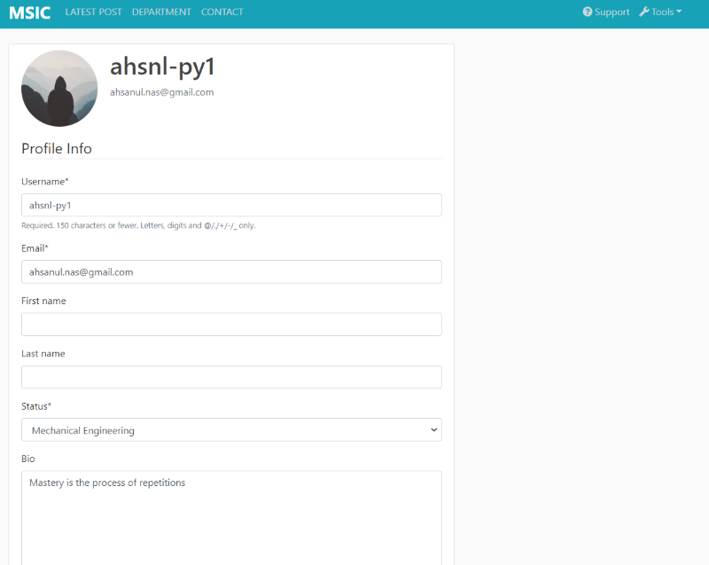

# MSIC
## About
MSIC is an abbreviate of Mechanics Student In Czech. Our aim is simple. To share and communicate. With more notes available and countless tips from different students, we believe we could all achieve great results. You could be as transparent or anonymous. All we value is your story and motive to help one another. 

## Want to help? follow instructions below..
Requires Python 3.5 or higher, recommended to run in a virtual environment (virtualenv, consider using virtualenvwrapper to manage your virtual environments).

### Installing virtual env 
```
pip install virtualenv
virtualenv my_env
source my_env/bin/activate
```
You can deactivate your environment at any time with the `deactivate` command

### Installing requirements:
```
pip install -r requirements.txt
```

### To run django webframework:
Start the development server by typing the following command from your project's root folder:
```
(my_env) /esicProject$ python manage.py runserver 
```

* You should find the site running on `http://localhost:8000`

* To login to the admin account go to `http://localhost:8000/admin`

### To run React js frontend:
Make sure Node.js is install or 
```
brew install node
```
Get packages (from root directory):
```
npm install
```
Build the front-end
```
(my_env) /esicProject/esicproject-web$ npm start
```
* You should find the site running on `http://localhost:3000`

### comming soon
Features are still under constructions. 
|   | 
|:--:| 
| * Register page* |

|  | 
|:--:| 
| *Login page* |

|  | 
|:--:| 
| *Sort subjects accoding to Department* |

|   | 
|:--:| 
| *Lists of post made by user only available when Registered* |

|   | 
|:--:| 
| *Profile detail. Only can be modified by user*  |

|   | 
|:--:| 
| *Create new post. You can also share files and images*  |

